# RevCast AI

**Probabilistic Revenue Forecasting & Budget Optimization for Paid Media**

> **Live Demo:** [https://revcast-frontend.onrender.com](https://revcast-frontend.onrender.com)
> **API Health:** [https://revcast-api.onrender.com/health](https://revcast-api.onrender.com/health)

RevCast AI helps marketers forecast e-commerce revenue across Google Ads, Meta Ads, and Microsoft Ads using a log-log elasticity model with residual bootstrap — delivering P10/P50/P90 probabilistic ranges, not single-point guesses.

Upload your ad-channel CSVs, configure budgets, and get calibrated revenue forecasts, budget simulations, AI-powered causal summaries, and interactive analytics — all in a clean 4-step wizard. Includes dark mode and mobile-responsive layout.


---

## Screenshots

### Step 1 — Upload CSV Data
Drop all 5 ad-channel CSVs and auto-validate data quality.

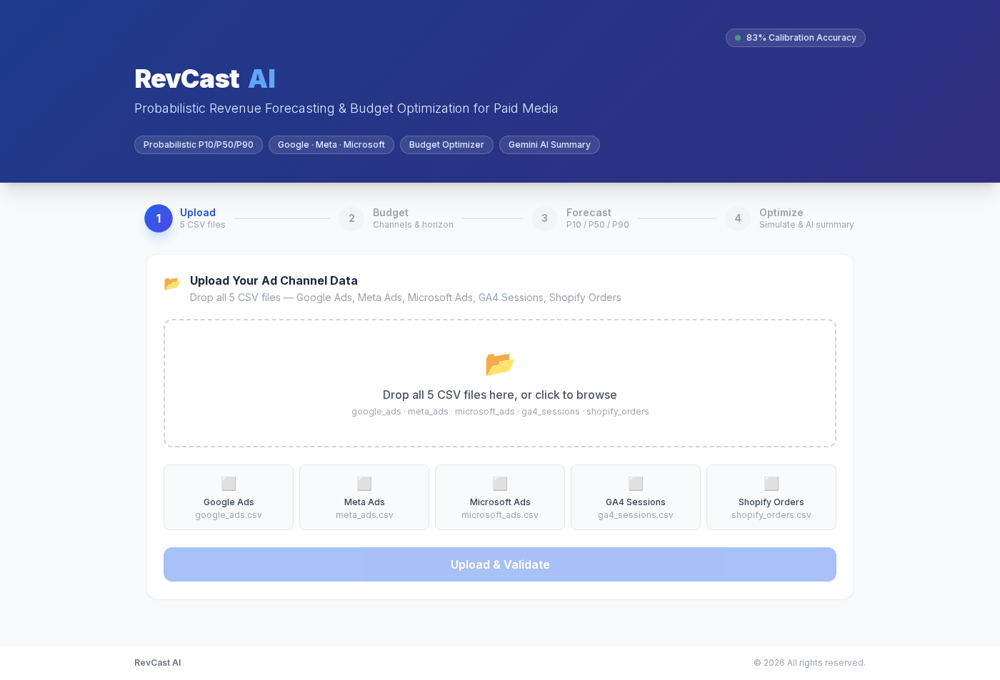

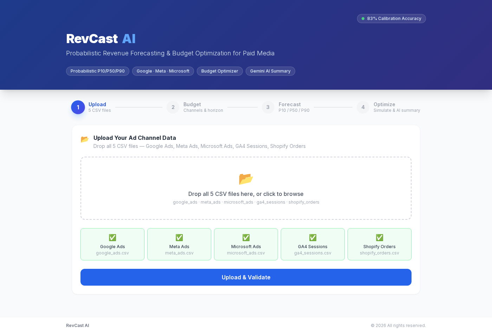

### Step 2 — Configure Budget & Horizon
Set per-channel spend and forecast horizon (30/60/90 days).

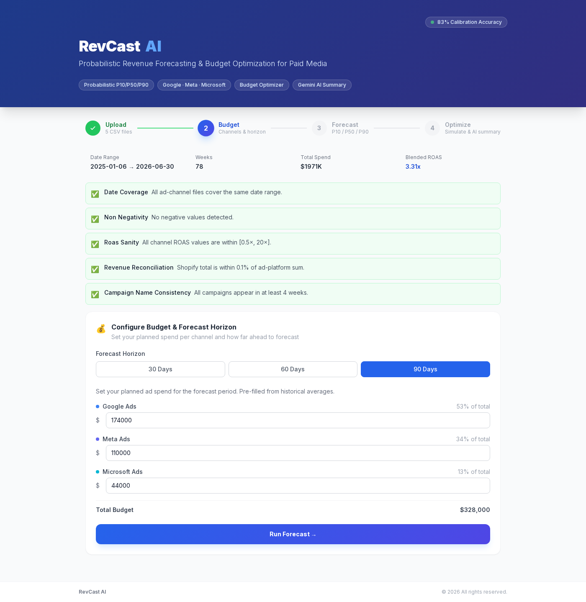

### Step 3 — Forecast Results

#### P10/P50/P90 Revenue Forecast
Probabilistic revenue and ROAS ranges with confidence bands.

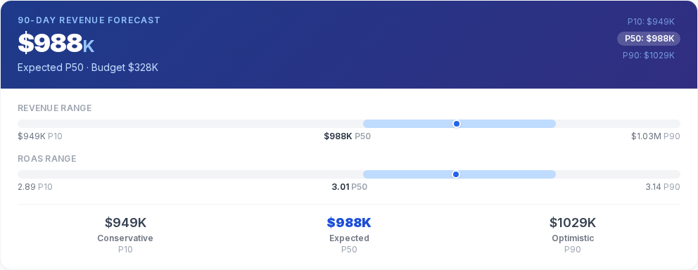

#### Channel Breakdown
Per-channel revenue, ROAS, elasticity, and R² with expandable campaign-type sub-rows.

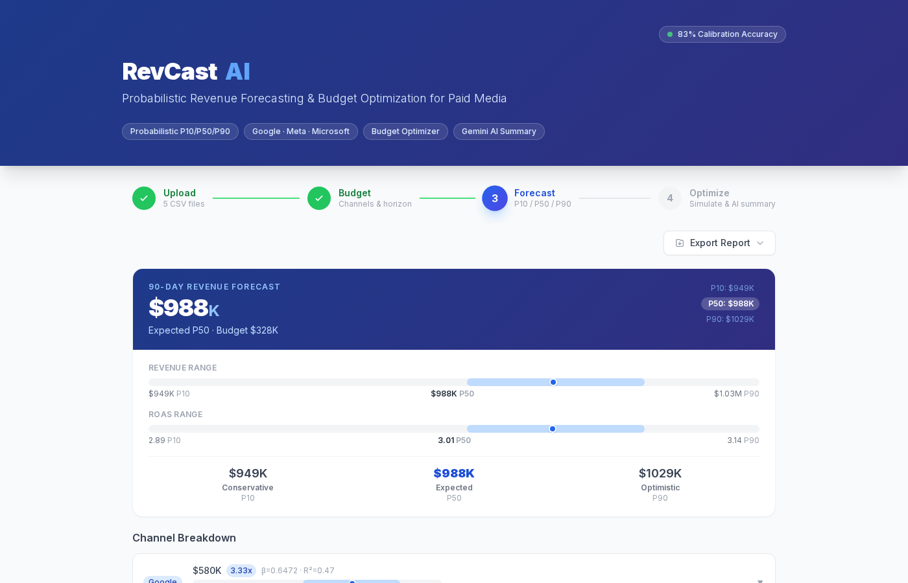

#### Revenue Attribution Waterfall
How each channel contributes to total P50 forecast revenue.

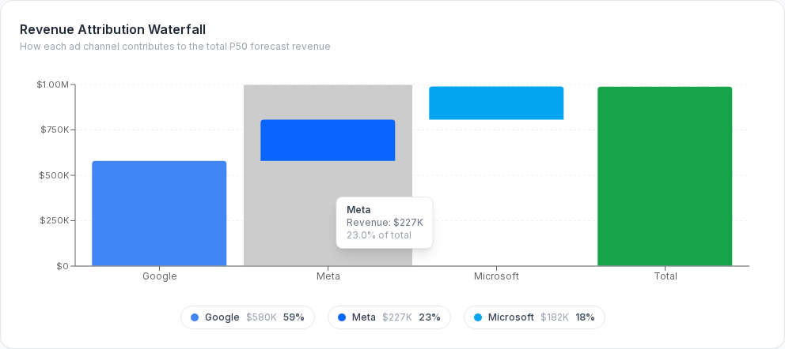

#### Channel Comparison Radar
Spider chart comparing channels across 5 dimensions: Elasticity, R², ROAS, Revenue Share, Precision.

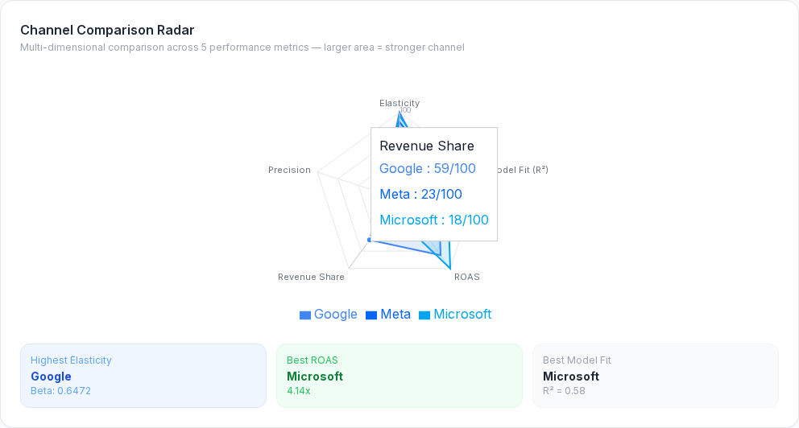

#### Diminishing Returns Curve
Per-channel spend-vs-revenue curve with ROAS and marginal ROAS overlays.

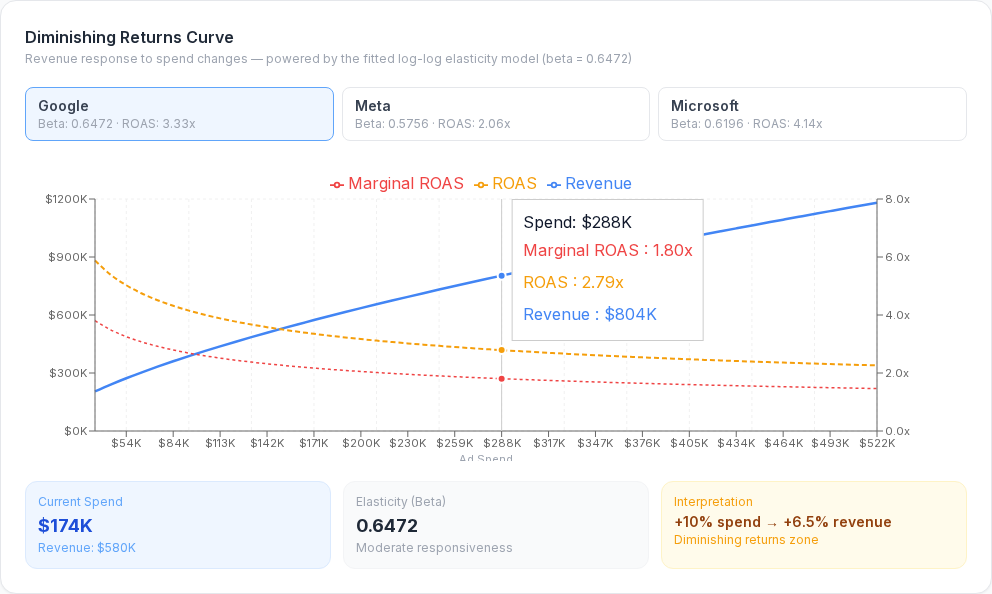

#### What-If Sensitivity Analysis
How +/-10–20% spend changes affect each channel's revenue.

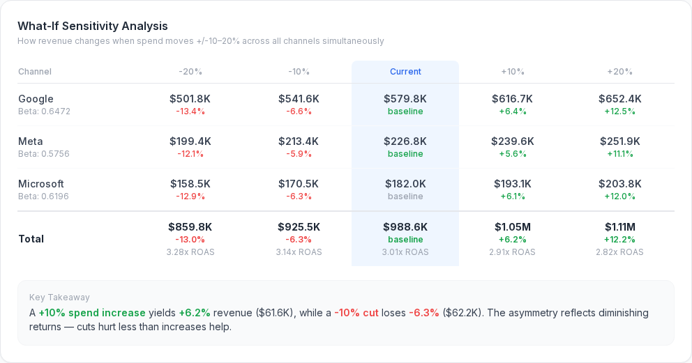

#### Seasonality Heatmap
Monthly revenue indices per channel with spend timing recommendations.

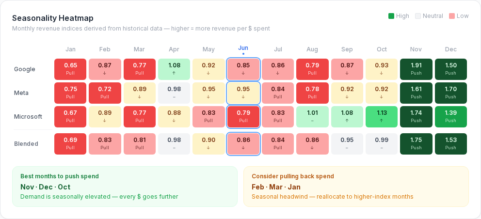

#### Auto-Generated Insights
Pure-math insight engine surfacing opportunities, risks, and model diagnostics — no AI call needed.

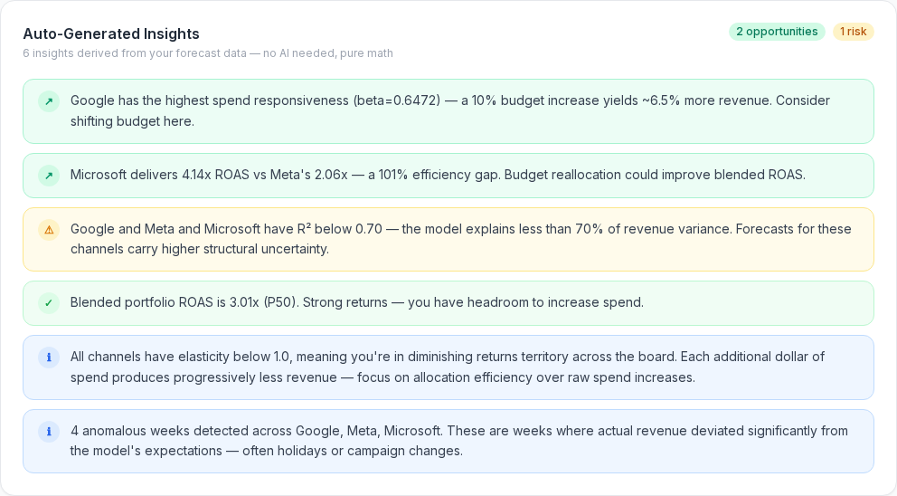

#### Calibration Time Machine
Holdout backtest proving 83% model accuracy — actual vs predicted P10–P90 band with hit/miss dots.

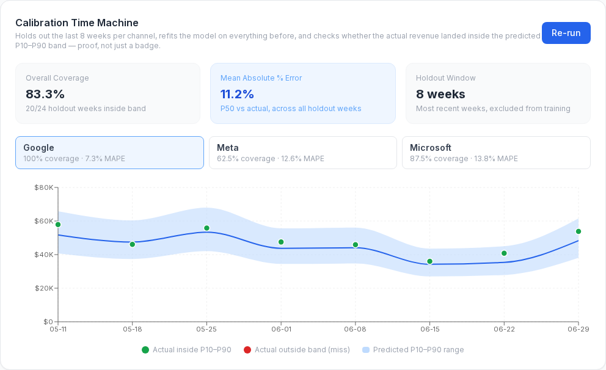

### Step 4 — Simulate & Optimize

#### Budget Scenario Simulation
5 pre-built scenarios (0.5x–2.0x) showing revenue and ROAS response curves.

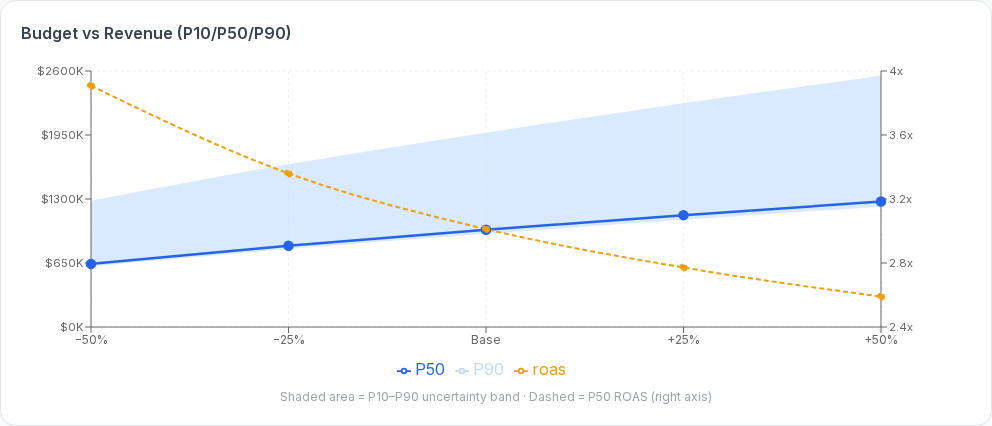

#### Budget Optimizer
SLSQP optimization with efficient frontier — finds the best channel allocation.

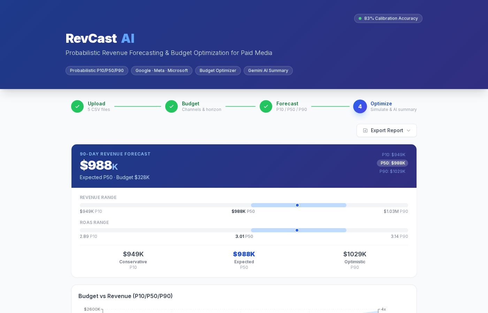

---

## Features

### Core Forecasting
- **Probabilistic P10/P50/P90 Forecasts** — Residual bootstrap (1000 draws) produces calibrated uncertainty ranges
- **Per-Channel Elasticity Models** — Log-log OLS with seasonal deseasonalization, holiday dummies, time trend, and conservative adstock decay
- **83% Calibration Accuracy** — Verified via holdout backtest
- **Model Comparison** — Baselines (naive, moving average, linear trend) prove the elasticity model adds value

### Budget Intelligence
- **Budget Simulator** — 5 pre-built scenarios (0.5x–2.0x)
- **Budget Optimizer** — SLSQP optimization with efficient frontier visualization
- **What-If Sensitivity Analysis** — +/-10–20% spend impact per channel

### Visualizations & Analytics
- **Revenue Attribution Waterfall** — Channel contribution breakdown
- **Channel Comparison Radar** — 5-dimension spider chart
- **Diminishing Returns Curve** — Per-channel spend-response with marginal ROAS
- **Seasonality Heatmap** — Monthly indices with spend timing recommendations
- **Calibration Time Machine** — Interactive holdout backtest with hit/miss dots

### AI & Insights
- **Gemini AI Causal Summary** — One-click AI analysis with risk factors and recommendations
- **Auto-Generated Insights** — Pure-math insight engine (no AI call needed)
- **Anomaly Detection** — Z-score flagging with automatic holiday labeling

### App Features
- **Dark Mode** — Toggle between light/dark themes, persists in localStorage, respects system preference
- **Mobile Responsive** — Full phone/tablet layout with adaptive components
- **JWT Authentication** — Register/login with secure password hashing (PBKDF2)
- **SQLite Database** — Persistent user storage
- **PDF/CSV Export** — Full forecast reports

---

## Tech Stack

| Layer | Technology |
|-------|-----------|
| **Backend** | Python 3.11, FastAPI, pandas, NumPy, statsmodels, SciPy, SQLite |
| **Frontend** | Next.js 14, React 18, TypeScript, Tailwind CSS, Recharts |
| **Auth** | JWT (HMAC-SHA256) + PBKDF2 password hashing |
| **AI** | Google Gemini (causal summary) |
| **Testing** | pytest (24 tests) |
| **Deployment** | Render.com (Blueprint), Docker |
| **Export** | jsPDF, jspdf-autotable |

---

## Quick Start (Local Development)

### Prerequisites
- Python 3.9+ with `pip`
- Node.js 18+
- (Optional) Gemini API key for AI summaries

### 1. Clone & Generate Sample Data

```bash
git clone https://github.com/keerthishree20/RevCast-AI.git
cd RevCast-AI
python data/generate_synthetic.py
```

### 2. Start the Backend

```bash
cd backend
pip install -r requirements.txt
python -m uvicorn main:app --host 0.0.0.0 --port 8001 --reload
```

Verify it's running:
```bash
curl http://localhost:8001/health
# → {"status": "ok"}
```

To enable AI summaries, pass your Gemini key:
```bash
GEMINI_API_KEY=your-key-here python -m uvicorn main:app --host 0.0.0.0 --port 8001 --reload
```

### 3. Start the Frontend

Open a **new terminal**:
```bash
cd frontend
npm install
npm run dev
```

Open **http://localhost:3000** in your browser.

> If port 3000 is busy: `npm run dev -- -p 3010` (CORS accepts any localhost port)

### 4. Run Tests

```bash
cd backend
python -m pytest tests/ -v
```

All 24 tests should pass — covering seasonality, elasticity, bootstrap, and API integration.

### 5. Use the App

1. **Register** — Create an account on the login page
2. **Upload** — Drop all 5 CSV files from `data/generated/` → click "Upload & Validate"
3. **Budget** — Adjust per-channel spend, choose 30/60/90 day horizon → "Run Forecast"
4. **Forecast** — Explore all visualizations, run calibration check, view auto-insights
5. **Optimize** — Simulate scenarios, run optimizer, generate AI summary, export report

---

## Run with Docker

```bash
# Build and start both services
docker-compose up --build

# Backend: http://localhost:8001
# Frontend: http://localhost:3000
```

To stop: `docker-compose down`

---

## Deploy to Render (Cloud)

The repo includes a `render.yaml` Blueprint for one-click deployment on [Render.com](https://render.com).

### Step-by-Step

1. **Sign in** to [render.com](https://render.com) with your GitHub account

2. Click **"New"** → **"Blueprint"**

3. Select the **RevCast-AI** repository

4. Render auto-detects `render.yaml` and shows 2 services:
   - `revcast-api` — Python backend (FastAPI)
   - `revcast-frontend` — Node.js frontend (Next.js)

5. Click **"Apply"** — both services build and deploy (~5 min)

6. Your live URLs will be:
   - **API:** `https://revcast-api.onrender.com`
   - **App:** `https://revcast-frontend.onrender.com`

### Environment Variables (set on Render dashboard)

| Service | Variable | Value |
|---------|----------|-------|
| `revcast-api` | `GEMINI_API_KEY` | Your Gemini key (optional) |
| `revcast-api` | `JWT_SECRET` | Auto-generated by Render |
| `revcast-api` | `CORS_ORIGINS` | `https://revcast-frontend.onrender.com` |
| `revcast-frontend` | `NEXT_PUBLIC_API_URL` | `https://revcast-api.onrender.com` |

### After Deployment

If Render assigns different service names (e.g., `revcast-api-abc1`), update:
- **Backend** `CORS_ORIGINS` → your actual frontend URL
- **Frontend** `NEXT_PUBLIC_API_URL` → your actual backend URL

> **Note:** Free tier services sleep after 15 min of inactivity. First request takes ~50s (cold start). Upgrade to paid for always-on.

---

## All Commands Reference

| Task | Command |
|------|---------|
| **Generate sample data** | `python data/generate_synthetic.py` |
| **Start backend** | `cd backend && python -m uvicorn main:app --host 0.0.0.0 --port 8001 --reload` |
| **Start frontend** | `cd frontend && npm install && npm run dev` |
| **Start frontend (custom port)** | `cd frontend && npm run dev -- -p 3010` |
| **Run tests** | `cd backend && python -m pytest tests/ -v` |
| **Build frontend** | `cd frontend && npm run build` |
| **Start production frontend** | `cd frontend && npm run build && npm start` |
| **Docker (both services)** | `docker-compose up --build` |
| **Health check** | `curl http://localhost:8001/health` |
| **Stop backend** | `pkill -f 'uvicorn main:app'` |
| **Stop frontend** | `pkill -f 'next dev'` |

---

## Project Structure

```
RevCast-AI/
├── backend/
│   ├── main.py                  # FastAPI app + CORS
│   ├── requirements.txt
│   ├── Dockerfile
│   ├── runtime.txt              # Python version for Render
│   ├── pytest.ini
│   ├── api/
│   │   ├── models.py            # Pydantic request/response schemas
│   │   └── routes/
│   │       ├── auth.py          # POST /api/auth/register, /api/auth/login
│   │       ├── ingest.py        # POST /api/ingest (CSV upload)
│   │       ├── validate.py      # POST /api/validate
│   │       ├── forecast.py      # POST /api/forecast
│   │       ├── simulate.py      # POST /api/simulate
│   │       ├── optimize.py      # POST /api/optimize
│   │       ├── calibration.py   # POST /api/calibration
│   │       ├── comparison.py    # POST /api/comparison (model baselines)
│   │       └── summary.py       # POST /api/summary (Gemini AI)
│   ├── core/
│   │   ├── auth.py              # JWT tokens + PBKDF2 password hashing
│   │   ├── baselines.py         # Naive/MA/Trend baseline models
│   │   ├── ingest.py            # CSV parsing + weekly aggregation
│   │   ├── validate.py          # Data quality checks
│   │   ├── seasonality.py       # Monthly index computation
│   │   ├── elasticity.py        # Log-log OLS per channel
│   │   ├── bootstrap.py         # Residual bootstrap → P10/P50/P90
│   │   ├── forecast_engine.py   # Pipeline orchestrator
│   │   ├── simulate.py          # Budget scenario sweeps
│   │   ├── optimizer.py         # SLSQP budget optimization
│   │   ├── calibration.py       # Holdout backtest engine
│   │   └── llm_summary.py       # Gemini integration
│   ├── state/
│   │   ├── session.py           # In-memory session store
│   │   └── database.py          # SQLite persistence (users)
│   └── tests/                   # 24 pytest tests
├── frontend/
│   ├── Dockerfile
│   ├── vercel.json              # Vercel deployment config
│   └── src/
│       ├── app/
│       │   ├── page.tsx         # 4-step wizard shell
│       │   ├── layout.tsx       # Root layout with providers
│       │   └── globals.css      # Theme variables + dark mode
│       ├── components/
│       │   ├── auth/            # AuthPage (login/register)
│       │   ├── upload/          # FileUploadZone, ValidationStatus
│       │   ├── budget/          # BudgetInputPanel, HorizonSelector
│       │   ├── forecast/        # 12 visualization components
│       │   ├── simulate/        # ScenarioSlider, ScenarioComparisonChart
│       │   ├── optimizer/       # BudgetOptimizerPanel
│       │   ├── summary/         # CausalSummaryPanel
│       │   └── export/          # ExportReportButton
│       ├── context/
│       │   ├── AuthContext.tsx   # JWT auth state
│       │   ├── AppContext.tsx    # Forecast/simulation state
│       │   └── ThemeContext.tsx  # Dark/light theme
│       └── lib/
│           ├── api.ts           # Typed API wrappers
│           ├── types.ts         # Shared TypeScript interfaces
│           └── export.ts        # PDF/CSV generation
├── data/
│   └── generate_synthetic.py    # Synthetic data generator
├── docker-compose.yml           # Docker orchestration
├── render.yaml                  # Render.com Blueprint
├── GUIDE.md                     # Complete project guide (zero to advanced)
└── CLAUDE.md                    # AI assistant instructions
```

---

## API Endpoints

| Method | Endpoint | Description |
|--------|----------|-------------|
| `GET` | `/health` | Health check |
| `POST` | `/api/auth/register` | Create account (email, name, password) |
| `POST` | `/api/auth/login` | Sign in (email, password) → JWT token |
| `POST` | `/api/ingest` | Upload 5 CSVs (multipart/form-data) |
| `POST` | `/api/validate` | Run data quality checks |
| `POST` | `/api/forecast` | Run forecast pipeline (P10/P50/P90) |
| `POST` | `/api/simulate` | Budget scenario simulation |
| `POST` | `/api/optimize` | Budget allocation optimizer |
| `POST` | `/api/calibration` | Holdout backtest |
| `POST` | `/api/comparison` | Model comparison (elasticity vs baselines) |
| `POST` | `/api/summary` | Gemini AI causal summary |

---

## How the Forecasting Works

```
CSV Upload → Weekly Aggregation → Seasonal Deseasonalization
    → Log-Log OLS (per channel)
        → Adstock CV (conservative λ selection)
        → Holiday dummy + time trend
    → Residual Bootstrap (1000 draws)
        → Heteroscedastic scaling (floor=1.2)
    → P10 / P50 / P90 Revenue & ROAS
```

**Key design decisions:**
- **Heteroscedastic floor of 1.2**: In-sample residuals are 2.3x narrower than true noise because monthly seasonal averaging absorbs variance. Floor calibrated via 8-week holdout to hit ~80% coverage.
- **Conservative adstock**: Lambda only accepted if it improves RMSE by ≥10% — spurious adstock fits hurt OOS calibration.
- **Time trend gating**: Trend coefficient zeroed unless `|t-stat| ≥ 1.96` to prevent extrapolation drift.

---

## CSV Format

The app expects 5 CSV files:

**Google/Meta/Microsoft Ads:**
```
date, campaign, campaign_type, spend, impressions, clicks, conversions, revenue
```

**GA4 Sessions:**
```
date, source, medium, sessions, engaged_sessions, conversions, revenue
```

**Shopify Orders:**
```
date, channel, orders, aov, revenue
```

Use `python data/generate_synthetic.py` to create sample files matching these schemas.

---

## Environment Variables

| Variable | Required | Description |
|----------|----------|-------------|
| `GEMINI_API_KEY` | Only for AI summary | Google Gemini API key |
| `NEXT_PUBLIC_API_URL` | No | Backend URL (defaults to `http://localhost:8001`) |
| `JWT_SECRET` | No | Token signing key (auto-generated on Render) |
| `CORS_ORIGINS` | No | Comma-separated allowed origins for production |
| `DB_PATH` | No | SQLite database path (defaults to `backend/revcast.db`) |

---

## Built With

Developed by **KeerthiShree TS** for the AIgnition 3.0 Hackathon.

---

## License

This project is for educational and demonstration purposes.
